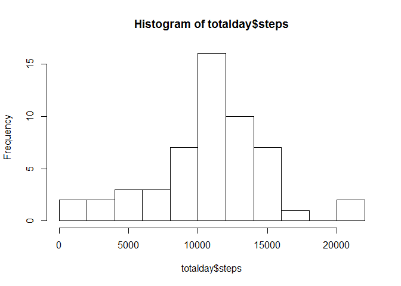
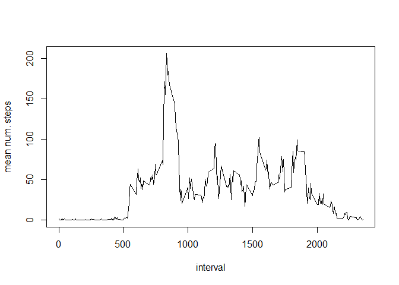
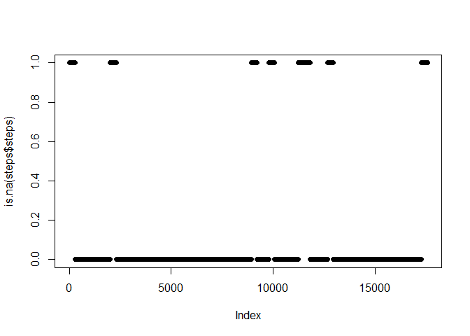
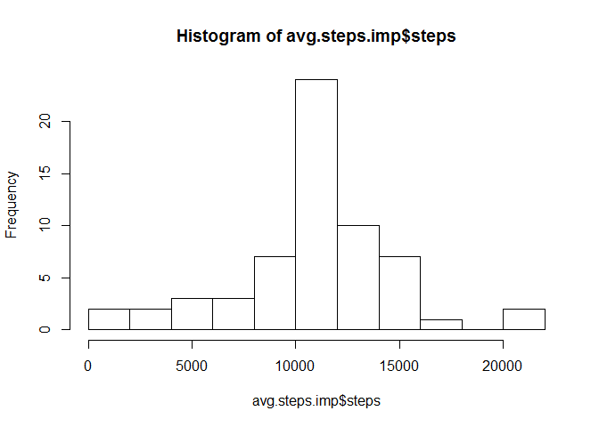
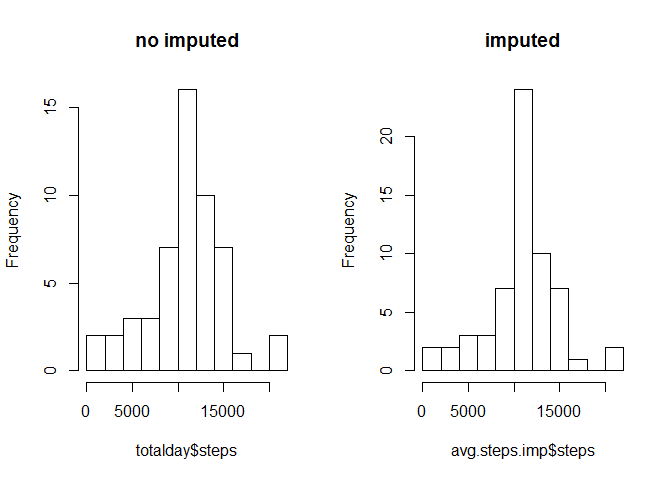
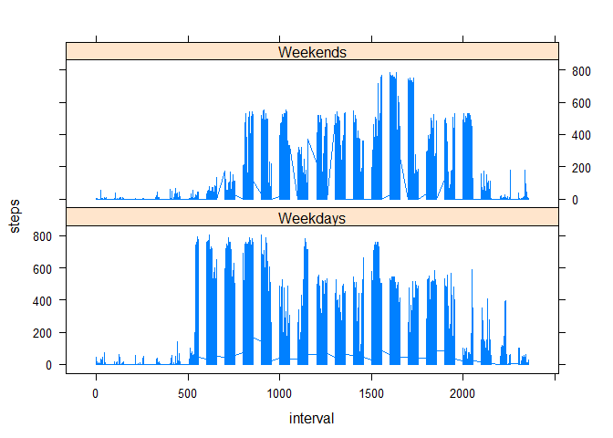

# Rep_Data-1-Asessment
Derik Castillo  
December 15, 2015  

This document presents all steps in the completion of the first assessment for the Reproducible Research course, as part of the Data Science specialization.

## General setup

Load packages


```r
library(timeDate)
```

```
## Warning: package 'timeDate' was built under R version 3.2.3
```

```r
library(lattice)
```

The first part of the setup is changing to the working directory


```r
setwd("C:/Users/Derik/Documents/R/coursera/steps")
```

Since the data is contained in the repository, there is no need to download the data from the provided URL. This step is therefore omitted.

The next step is to unzip and read the data. 


```r
unzip("activity.zip")
steps<-read.csv("activity.csv")
```

To have a quick look at the data and its main characteristics, including the type of variables that were read, use the `str` function.


```r
str(steps)
```

```
## 'data.frame':	17568 obs. of  3 variables:
##  $ steps   : int  NA NA NA NA NA NA NA NA NA NA ...
##  $ date    : Factor w/ 61 levels "2012-10-01","2012-10-02",..: 1 1 1 1 1 1 1 1 1 1 ...
##  $ interval: int  0 5 10 15 20 25 30 35 40 45 ...
```

The ``date` variable is a text, and moreover, was read as a factor. This is useful fr the first part of the questions, but in orer to get a time series, it will be necessary to transform it into a POSIXct variable.


```r
steps$days<-strptime(steps$date, format="%Y-%m-%d")
```

## Mean number of steps

The first result to obtain is the mean total number of steps per day.  This can be done with the factor date.


```r
totalday<-aggregate(steps ~ date, data=steps, sum)
```

Using the second column of the aggregated data I can create the histogram

```r
hist(totalday$steps,breaks=10)
```

 

This histogram shows a roughly symmetrical pattern, with a maximum of days with 10000 steps, and few days with very small number of steps and very high number of steps.

The mean and median of the total number of steps per day is


```r
aggregate(steps ~ date, data=steps, FUN=function(x) c(mean=mean(x),median=median(x)))
```

```
##          date steps.mean steps.median
## 1  2012-10-02  0.4375000    0.0000000
## 2  2012-10-03 39.4166667    0.0000000
## 3  2012-10-04 42.0694444    0.0000000
## 4  2012-10-05 46.1597222    0.0000000
## 5  2012-10-06 53.5416667    0.0000000
## 6  2012-10-07 38.2465278    0.0000000
## 7  2012-10-09 44.4826389    0.0000000
## 8  2012-10-10 34.3750000    0.0000000
## 9  2012-10-11 35.7777778    0.0000000
## 10 2012-10-12 60.3541667    0.0000000
## 11 2012-10-13 43.1458333    0.0000000
## 12 2012-10-14 52.4236111    0.0000000
## 13 2012-10-15 35.2048611    0.0000000
## 14 2012-10-16 52.3750000    0.0000000
## 15 2012-10-17 46.7083333    0.0000000
## 16 2012-10-18 34.9166667    0.0000000
## 17 2012-10-19 41.0729167    0.0000000
## 18 2012-10-20 36.0937500    0.0000000
## 19 2012-10-21 30.6284722    0.0000000
## 20 2012-10-22 46.7361111    0.0000000
## 21 2012-10-23 30.9652778    0.0000000
## 22 2012-10-24 29.0104167    0.0000000
## 23 2012-10-25  8.6527778    0.0000000
## 24 2012-10-26 23.5347222    0.0000000
## 25 2012-10-27 35.1354167    0.0000000
## 26 2012-10-28 39.7847222    0.0000000
## 27 2012-10-29 17.4236111    0.0000000
## 28 2012-10-30 34.0937500    0.0000000
## 29 2012-10-31 53.5208333    0.0000000
## 30 2012-11-02 36.8055556    0.0000000
## 31 2012-11-03 36.7048611    0.0000000
## 32 2012-11-05 36.2465278    0.0000000
## 33 2012-11-06 28.9375000    0.0000000
## 34 2012-11-07 44.7326389    0.0000000
## 35 2012-11-08 11.1770833    0.0000000
## 36 2012-11-11 43.7777778    0.0000000
## 37 2012-11-12 37.3784722    0.0000000
## 38 2012-11-13 25.4722222    0.0000000
## 39 2012-11-15  0.1423611    0.0000000
## 40 2012-11-16 18.8923611    0.0000000
## 41 2012-11-17 49.7881944    0.0000000
## 42 2012-11-18 52.4652778    0.0000000
## 43 2012-11-19 30.6979167    0.0000000
## 44 2012-11-20 15.5277778    0.0000000
## 45 2012-11-21 44.3993056    0.0000000
## 46 2012-11-22 70.9270833    0.0000000
## 47 2012-11-23 73.5902778    0.0000000
## 48 2012-11-24 50.2708333    0.0000000
## 49 2012-11-25 41.0902778    0.0000000
## 50 2012-11-26 38.7569444    0.0000000
## 51 2012-11-27 47.3819444    0.0000000
## 52 2012-11-28 35.3576389    0.0000000
## 53 2012-11-29 24.4687500    0.0000000
```

## Average daily activity pattern

To display the daily activity pattern a times series will be plotted. This requieres the date to be in the POSIX format. Given that there are multiple time intervals labeled "0", "5", "10", and so on, first the mean for each time interval will be computed, and then the times series wil be produced. This ensures that each time interval is plotted only once. Moreover, one can assume that all intervals with the same label have similar characteristics.

This may not be considered a times series, because it does not represents a process sampled at regular intervals , but an aggregated measure.


```r
steps.min<-aggregate(steps ~ interval, data = steps, FUN = "mean")
plot(steps~interval, data=steps.min,type="l",ylab="mean num. steps")
```

 

One can ask for the maximum activity across all 5-minute intervals. From the data that produced the time-series plot, it is possible to select the maximum and then obtain the label for the corresponding interval.


```r
pos<-which(steps.min$steps==max(steps.min$steps))
max.int<-steps.min[pos,1]
max.steps<-steps.min[pos,2]
```

Therefore, the time interval with maximum activity, measured as the average number of steps across al time intervals with the same label is 835, with an average of  206.1698113 steps.

## Imputing missing values

The data contains missing data, coded as `NA`. To get an idea of how many `NA`s are in the dataset and where are they, the followig table contains the number of missing data for each column. 


```r
colSums(is.na(steps))
```

```
##    steps     date interval     days 
##     2304        0        0        0
```

It is clear that only the `steps` variable contains `NA`.

The following step is imputing missing values. To get an idea if the `NA` are clumped together or dispersed along time, missing data coded as ones and valid data coded as zeros will be plotted against the index of the variable.


```r
plot(is.na(steps$steps))
```

 

The plot reveals seven stretches of missing values, along the variable. The size of the stretches seems considerable, to get a better idea, lets compute the size of each stretch of `NA`.


```r
#define variables
stretches<-rep(0,7)
n<-1
#do a for loop for all the indexes in the variable
for (i in 1:(length(steps$steps)-1))
{ #if there are two NA in a row
  if (is.na(steps$steps[i]) & is.na(steps$steps[i+1])) 
  { #increase stretch size
    stretches[n]<-stretches[n]+1
  }
  if (is.na(steps$steps[i]) & !is.na(steps$steps[i+1]))
  { #if the stretch ends, complete the stretch size and move to next one
    stretches[n]<-stretches[n]+1
    n<-n+1
  }
}
```

The seven lengths of `NA` in the dataset are 288, 288, 288, 288, 576, 288, 287. Given the size of the stretches of missing data, the best way to imputing them is to use the mean for the number of steps in the five-minute interval that corresponds. The mean number of steps will be taken from the `steps.min` object. The imputed data will be in the variable steps.imputed


```r
steps.imputed<-steps
for (i in 1:length(steps.imputed$steps))
{
  if (is.na(steps.imputed$steps[i]))
  {
  #i is the index. find the interval label
  target<-steps.imputed$interval[i]
  #find the row number in the minutes mean table
  min.row<-which(steps.min$interval==target,arr.ind = T)
  #copy it to the original variable with missing `steps`
  steps.imputed$steps[i]<-steps.min[min.row,2]
  }
}
```

The average number of steps by day can be calculates using the same principle as above. I first compute the aggregated means for each day and then the histgram (with the same number of breaks for comparison).


```r
#this is the average by day
avg.steps.imp<-aggregate(steps ~ date, data=steps.imputed, FUN=sum)
#now the histogram with 10 breaks
hist(avg.steps.imp$steps,breaks=10)
```

 

The mean and median number of steps per day can be calculated as above using


```r
aggregate(steps ~ date, data=steps.imputed, FUN=function(x) c(mean=mean(x),median=median(x)))
```

```
##          date steps.mean steps.median
## 1  2012-10-01 37.3825996   34.1132075
## 2  2012-10-02  0.4375000    0.0000000
## 3  2012-10-03 39.4166667    0.0000000
## 4  2012-10-04 42.0694444    0.0000000
## 5  2012-10-05 46.1597222    0.0000000
## 6  2012-10-06 53.5416667    0.0000000
## 7  2012-10-07 38.2465278    0.0000000
## 8  2012-10-08 37.3825996   34.1132075
## 9  2012-10-09 44.4826389    0.0000000
## 10 2012-10-10 34.3750000    0.0000000
## 11 2012-10-11 35.7777778    0.0000000
## 12 2012-10-12 60.3541667    0.0000000
## 13 2012-10-13 43.1458333    0.0000000
## 14 2012-10-14 52.4236111    0.0000000
## 15 2012-10-15 35.2048611    0.0000000
## 16 2012-10-16 52.3750000    0.0000000
## 17 2012-10-17 46.7083333    0.0000000
## 18 2012-10-18 34.9166667    0.0000000
## 19 2012-10-19 41.0729167    0.0000000
## 20 2012-10-20 36.0937500    0.0000000
## 21 2012-10-21 30.6284722    0.0000000
## 22 2012-10-22 46.7361111    0.0000000
## 23 2012-10-23 30.9652778    0.0000000
## 24 2012-10-24 29.0104167    0.0000000
## 25 2012-10-25  8.6527778    0.0000000
## 26 2012-10-26 23.5347222    0.0000000
## 27 2012-10-27 35.1354167    0.0000000
## 28 2012-10-28 39.7847222    0.0000000
## 29 2012-10-29 17.4236111    0.0000000
## 30 2012-10-30 34.0937500    0.0000000
## 31 2012-10-31 53.5208333    0.0000000
## 32 2012-11-01 37.3825996   34.1132075
## 33 2012-11-02 36.8055556    0.0000000
## 34 2012-11-03 36.7048611    0.0000000
## 35 2012-11-04 37.3825996   34.1132075
## 36 2012-11-05 36.2465278    0.0000000
## 37 2012-11-06 28.9375000    0.0000000
## 38 2012-11-07 44.7326389    0.0000000
## 39 2012-11-08 11.1770833    0.0000000
## 40 2012-11-09 37.3825996   34.1132075
## 41 2012-11-10 37.3825996   34.1132075
## 42 2012-11-11 43.7777778    0.0000000
## 43 2012-11-12 37.3784722    0.0000000
## 44 2012-11-13 25.4722222    0.0000000
## 45 2012-11-14 37.3825996   34.1132075
## 46 2012-11-15  0.1423611    0.0000000
## 47 2012-11-16 18.8923611    0.0000000
## 48 2012-11-17 49.7881944    0.0000000
## 49 2012-11-18 52.4652778    0.0000000
## 50 2012-11-19 30.6979167    0.0000000
## 51 2012-11-20 15.5277778    0.0000000
## 52 2012-11-21 44.3993056    0.0000000
## 53 2012-11-22 70.9270833    0.0000000
## 54 2012-11-23 73.5902778    0.0000000
## 55 2012-11-24 50.2708333    0.0000000
## 56 2012-11-25 41.0902778    0.0000000
## 57 2012-11-26 38.7569444    0.0000000
## 58 2012-11-27 47.3819444    0.0000000
## 59 2012-11-28 35.3576389    0.0000000
## 60 2012-11-29 24.4687500    0.0000000
## 61 2012-11-30 37.3825996   34.1132075
```

To compare both histograms, and see the impact of the imputing the data, both histograms will be put side by side.


```r
par(mfrow=c(1,2))
hist(totalday$steps,breaks=10, main="no imputed")
hist(avg.steps.imp$steps,breaks=10, main="imputed")
```

 

The effect of imputing values can be expected to increase the total number of steps per day. The reason is that all zeros in the database, are now imputed with positive numbers, thus increasing the daily total.

The next step is to compare weekdays and weekends. A new variable is creates, which is a factor with two levels. Weekdays and Weekends


```r
wday<-isWeekday(steps.imputed$days)
wday<-factor(wday,levels=c("TRUE","FALSE"),labels=c("Weekdays","Weekends"))
steps.imputed$wday<-wday
```

Then a lattice plot is produced to compare the mean activity for each 5-minute interval in the imputed dasta set.


```r
#first aggregate the means or the steps by interval
step.min.imp<-aggregate(steps~interval, data=steps.imputed, FUN=mean)
#then order by interval
steps.imputed.order<-steps.imputed[order(steps.imputed$interval),]
#then produce the plot
xyplot(steps~interval|wday,data=steps.imputed.order,layout=c(1,2),type="l")
```

 
